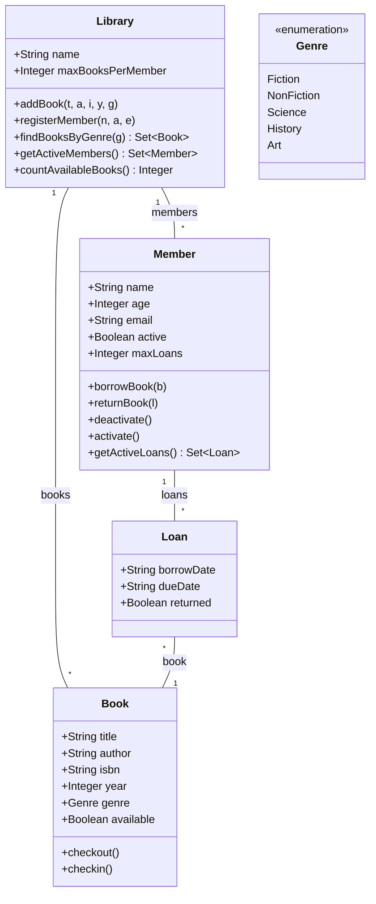

# SEMM Lab 2 — OCL Constraints with USE Tool

## Domain: Library Management System

A UML model of a library system with OCL constraints, validated using the [USE tool](https://github.com/useocl/use) (v7.1.1).

### Class Diagram



## Project Structure

| File | Description |
|---|---|
| `library.use` | USE model: classes, associations, 18 invariants, 4 queries, 35 pre/post-conditions |
| `valid-objects.soil` | 10 valid objects (1 library, 4 books, 3 members, 2 loans) — all invariants pass |
| `invalid-objects.soil` | 7 invalid objects violating 9 invariant checks (empty title, underage, empty ISBN, etc.) |

## OCL Requirements Coverage

| Requirement | Count |
|---|---|
| Interrelated classes | 4 (Library, Book, Member, Loan) |
| Invariants (≥10) | 18 |
| Pre-conditions (≥10) | 17 |
| Post-conditions (≥10) | 18 |
| Post-conditions with `@pre` (≥5) | 8 |
| Invariants with collection operations (≥5) | 8 |
| Post-conditions with collection operations (≥5) | 6 |
| Different collection operations (≥5, incl. `collect`, `select`) | 10 (`select`, `collect`, `forAll`, `exists`, `isUnique`, `size`, `isEmpty`, `includes`, `asSet`, `flatten`) |
| Collection of collections (≥2) | 2 (`allLoansReferenceLibraryBooks`, `borrowedBooksInLibrary`) |
| Invariants with collection types (≥3) | 3 (`Bag(Book)`, `Set(Loan)`, `Set(Genre)`) |
| Local variables (≥3) | 5 |
| Queries (≥3, ≥2 with collections) | 4 (all use `select`) |
| Tuples (≥2) | 2 (`memberInfoTuple`, `loanDatesTuple`) |
| Valid objects (≥10) | 10 |
| Invalid objects (≥5) | 7 (9 invariant failures) |

## How to Run

### Prerequisites
- Java 21+ installed

### Steps

1. Download [USE v7.1.1](https://github.com/useocl/use/releases/tag/v7.1.1) and extract it.

2. **Launch USE GUI:**
   ```
   use-7.1.1/bin/use library.use
   ```

3. **Load valid objects** (from USE shell or GUI File → Open):
   ```
   open valid-objects.soil
   ```

4. **Check invariants:**
   ```
   check
   ```
   Expected: `checked 18 invariants, 0 failures`

5. **Reset and load invalid objects:**
   ```
   reset
   open invalid-objects.soil
   check
   ```
   Expected: `checked 18 invariants, 9 failures`

### Non-GUI mode
```
use-7.1.1/bin/use -nogui library.use
```
Then type `open valid-objects.soil` and `check`.
